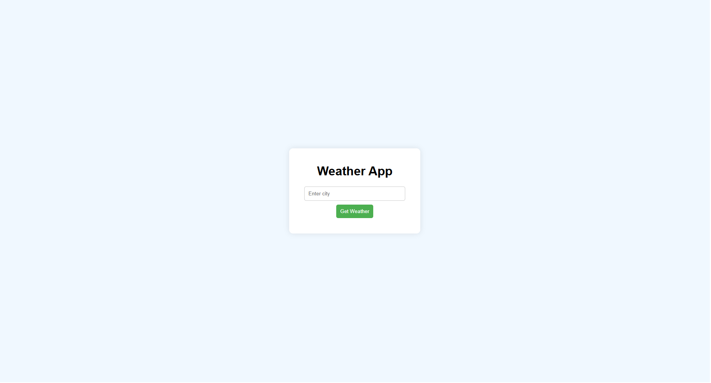
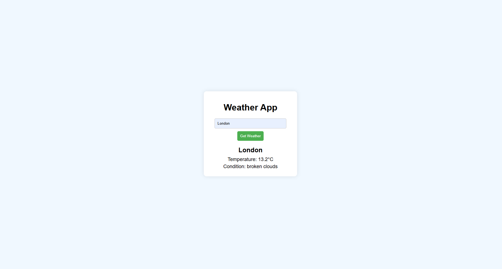

# Weather App

This is a simple weather application built using **HTML**, **CSS**, and **JavaScript**. The app allows users to search for weather information by entering the name of a city. It fetches the weather data from the **OpenWeatherMap API** and displays the current temperature and weather condition for that city.

### Features

- **City Search**: Users can input the name of a city.
- **Fetch Weather Data**: The app fetches data from the OpenWeatherMap API using the city name.
- **Display Weather**: It shows the temperature (in Celsius) and weather condition (e.g., "Clear sky", "Rainy", etc.) for the selected city.
- **Responsive Design**: The app is designed to work well on both desktop and mobile devices.

### Technologies Used

- **HTML**: Used for the basic structure of the app (form input and output display).
- **CSS**: For styling and creating a simple, user-friendly interface.
- **JavaScript**: To handle user input, fetch data from the API, and display the weather information.
- **OpenWeatherMap API**: Provides weather data based on city names.

### How to Run the Project Locally

1. Clone this repository to your local machine.

   ```bash
   git clone https://github.com/your-username/weather-app.git
   ```

2. Go to the project directory.

   ```bash
   cd weather-app
   ```

3. Open the `index.html` file in your browser.

   ```bash
   open index.html   # On macOS
   start index.html  # On Windows
   xdg-open index.html # On Linux
   ```

4. Enter the name of a city in the input field and click the "Get Weather" button.

### How to Get Your API Key

To make this project work, you'll need to sign up for an API key from **OpenWeatherMap**:

1. Go to the OpenWeatherMap website: [https://openweathermap.org](https://openweathermap.org).
2. Create a free account.
3. After signing in, navigate to the API section and get your **API key**.
4. Replace the `apiKey` value in `script.js` with your API key:

   ```javascript
   const apiKey = "your-api-key-here";  // Replace with your actual API key
   ```

### Files in this Project

- **index.html**: Contains the HTML structure of the app.
- **style.css**: Provides the styles for the weather app, making it visually appealing and easy to use.
- **script.js**: Contains the JavaScript that handles user input, fetches weather data from the OpenWeatherMap API, and updates the page with the fetched weather information.

### Example Usage

- Enter a city name like **"London"** in the input field and click **"Get Weather"**.
- The app will display the temperature and weather condition for London.

### Screenshots



---




### Issues and Contributions

Feel free to open an issue if you encounter any problems or bugs with the app. Contributions are welcome—feel free to fork this project and submit a pull request with your improvements.
